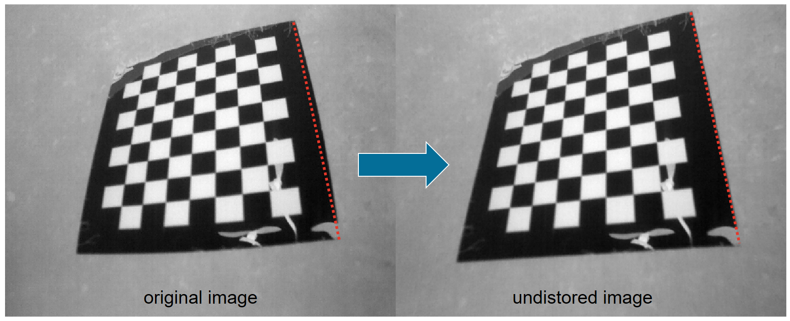

# AOS/CAM: Acquiring samples for Airborne Optical Sectioning using a frame grabber connected to the thermal camera

This is a Python implementation for acquiring and correcting thermal camera images for Airborne Optical Sensing. 



## Requirements

Make sure that the [required Python libraries](../requirements.txt) are installed.

## Quick tutorial


```py
import multiprocessing
import time
import cv2
from Camera import CameraControl
from Undistort import Undistort


#set up a queue and events to communicate with the camera process
frame_queue, camera_process_event, get_frames_event = multiprocessing.Queue(maxsize=1000), multiprocessing.Event(), multiprocessing.Event()

# init a camera class
camera_class = CameraControl()

# init the undistortion class
ud = Undistort()

#start the camera_process as a separate process
camera_process = multiprocessing.Process(name = 'camera_process',target=camera_class.AcquireFrames, args=(frame_queue, camera_process_event, get_frames_event))
camera_process.start()

# Start recording by sending an event signal 
get_frames_event.set()

# ...

# Retrieve recorded frames
frames_info = frame_queue.get()
# frames_info is dictionary of the form { 'Frames': [img1, img2, ...] 'FrameTimes': [time1, time2, ...] }
times = frames_info['FrameTimes']

# undistort the recorded frames
for image in frames_info['Frames']:
    undistored = ud.undistort( image )

# Stop recording by sending an event
camera_process_event.set()

# cleanup
frame_queue.close()
camera_process.join(5) 
if camera_process.is_alive() :
    camera_process.terminate()
```

## More detailed usage

For a more detailed example on the classes `Camera` and `Undistort` look at the main programs in `Camera.py` and `Undistort.py`.

### Using your/different camera
When using a different thermal camera there might be a need for modifications. 
If the camera (or the frame grabber) is a USB camera supported by OpenCV's `VideoCapture` method, the `Camera.py` class will work.

Applying a new camera (or frame grabber) with different optics or changed resolution, however, requires a calibration. We use a checkerboard pattern to calibrate our thermal camera. The calibration pattern is a metal plate with velvet squares and you need to record several images where the board is visible.
You can use OpenCV's `calibrateCamera` function to obtain the distortion coefficients and the camera matrix as explained [here](https://docs.opencv.org/master/dc/dbb/tutorial_py_calibration.html). Alternatively, you can use Matlab's camera calibration app (available with the Image Processing Toolbox).

Below you can find exemplary distortion coefficients and a camera matrix:
```py
distCoeff = np.array([ -0.2536, 0.0649, 0., 0., 0.  ])
cameraMatrix = np.array( [
        [ 417.8933,   0.0,       344.4168],
        [ 0.0,        526.2962,  206.0617],
        [ 0.0,        0.0,       1.0 ]
    ])
```

### Calibration pattern

To perform rectification and calibration with our camera, we used a metal plate with black velvet squares (sidelength = 5cm) glued to it and aligned in a checker board pattern (9 x 8 checkerboard pattern as shown below). RGB camera can detect the color difference whereas the thermal camera detects the temperature difference between the metal and the velvet squares. 

